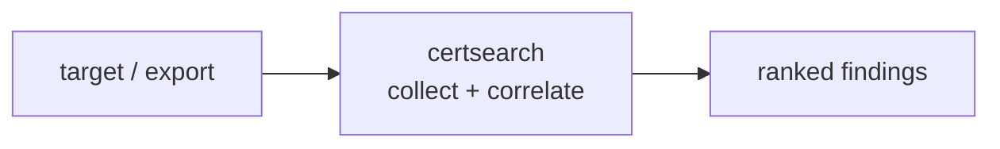

<a name="top"></a>
<div align="center">


# CERTSEARCH

### Analyze Certificate-Transparency exports for subdomains & rogue issuance


[](https://pypi.org/project/cognis-certsearch/) [](https://github.com/cognis-digital/certsearch/actions) [](LICENSE) [](https://github.com/cognis-digital)

*Part of the Cognis Neural Suite.*

</div>

```bash
pip install cognis-certsearch
certsearch scan .            # → prioritized findings in seconds
```


<!-- cognis:example:start -->
## 🔎 Example output

Real, reproducible output from the tool — runs offline:

```console
$ certsearch-emit --version
certsearch 0.1.0
```

```console
$ certsearch-emit --help
usage: certsearch [-h] [--version] {analyze} ...

Analyze Certificate-Transparency exports for subdomains and rogue issuance
(defensive recon on domains you own).

positional arguments:
  {analyze}
    analyze   analyze a CT export for one base domain

options:
  -h, --help  show this help message and exit
  --version   show program's version number and exit
```

> Blocks above are real `certsearch` output — reproduce them from a clone.

**Sample result format** _(illustrative values — run on your own data for real findings):_

```
{
"feed": {
"type": "STIX",
"id": "urn:uuid:12345678-1234-1234-1234-123456789012"
},
"objects": [
{
"type": "indicator",
"id": "i-12345678-1234-1234-1234-123456789012",
"name": "Suspicious DNS Query",
"description": "DNS query for suspicious domain",
"created_by": "certsearch",
"modified": "2023-02-20T14:30:00.000Z",
"labels": ["suspicious", "dns"],
"observables": [
{
"type": "domain-name",
"value": "example.com"
},
{
"type": "dns-query",
"value": "A example.com"
}
]
}
]
}
```

<!-- cognis:example:end -->

## Usage — step by step

`certsearch` analyzes a Certificate-Transparency export to surface subdomains for one base domain.

1. **Install**:
   ```bash
   pip install -e .
   ```
2. **Analyze a CT export** (JSON/JSONL/CSV) for a base domain:
   ```bash
   certsearch analyze ct-export.jsonl -d example.com
   ```
3. **Pipe the export via stdin**:
   ```bash
   cat ct-export.json | certsearch analyze - -d example.com
   ```
4. **Write a report** to a file as JSON or HTML:
   ```bash
   certsearch analyze ct-export.jsonl -d example.com --format html -o report.html
   ```
5. **Automate in CI/cron** — emit JSON for an attack-surface monitor:
   ```bash
   certsearch analyze ct-export.jsonl -d example.com --format json -o subdomains.json
   ```

## Contents

- [Why certsearch?](#why) · [Features](#features) · [Quick start](#quick-start) · [Example](#example) · [Architecture](#architecture) · [AI stack](#ai-stack) · [How it compares](#how-it-compares) · [Integrations](#integrations) · [Install anywhere](#install-anywhere) · [Related](#related) · [Contributing](#contributing)

<a name="why"></a>
## Why certsearch?

Analyze Certificate-Transparency exports for subdomains & rogue issuance — without standing up heavyweight infrastructure.

`certsearch` is single-purpose, scriptable, and self-hostable: point it at a target, get prioritized results in the format your workflow already speaks (table · JSON · SARIF), gate CI on it, and let agents drive it over MCP.

<div align="right"><a href="#top">↑ back to top</a></div>

<a name="features"></a>
## Features

- ✅ Parse Export
- ✅ Analyze
- ✅ Runs on Linux/macOS/Windows · Docker · devcontainer
- ✅ Ports in Python, JavaScript, Go, and Rust (`ports/`)

<div align="right"><a href="#top">↑ back to top</a></div>

<a name="quick-start"></a>
## Quick start

```bash
pip install cognis-certsearch
certsearch --version
certsearch scan .                       # scan current project
certsearch scan . --format json         # machine-readable
certsearch scan . --fail-on high        # CI gate (non-zero exit)
```

<div align="right"><a href="#top">↑ back to top</a></div>

<a name="example"></a>
## Example

```text
$ certsearch scan .
  [HIGH    ] CER-001  example finding             (./src/app.py)
  [MEDIUM  ] CER-002  another signal              (./config.yaml)

  2 findings · risk score 5 · 38ms
```

<div align="right"><a href="#top">↑ back to top</a></div>

<a name="architecture"></a>
## Architecture



<div align="right"><a href="#top">↑ back to top</a></div>

<a name="ai-stack"></a>
## Use it from any AI stack

`certsearch` is interoperable with every popular way of using AI:

- **MCP server** — `certsearch mcp` (Claude Desktop, Cursor, Cognis.Studio, [uncensored-fleet](https://github.com/cognis-digital/uncensored-fleet))
- **OpenAI-compatible / JSON** — pipe `certsearch scan . --format json` into any agent or LLM
- **LangChain · CrewAI · AutoGen · LlamaIndex** — wrap the CLI/JSON as a tool in one line
- **CI / scripts** — exit codes + SARIF for non-AI pipelines

<div align="right"><a href="#top">↑ back to top</a></div>

<a name="how-it-compares"></a>
## How it compares

| | **Cognis certsearch** | typical tools |
|---|:---:|:---:|
| Self-hostable, no account | ✅ | varies |
| Single command, zero config | ✅ | ⚠️ |
| JSON + SARIF for CI | ✅ | varies |
| MCP-native (AI agents) | ✅ | ❌ |
| Polyglot ports (JS/Go/Rust) | ✅ | ❌ |
| Open license | ✅ COCL | varies |
<div align="right"><a href="#top">↑ back to top</a></div>

<a name="integrations"></a>
## Integrations

Pipes into your stack: **SARIF** for code-scanning, **JSON** for anything, an **MCP server** (`certsearch mcp`) for AI agents, and a webhook forwarder for SIEM/Slack/Jira. See [`docs/INTEGRATIONS.md`](docs/INTEGRATIONS.md).

<div align="right"><a href="#top">↑ back to top</a></div>

<a name="install-anywhere"></a>
## Install — every way, every platform

```bash
pip install "git+https://github.com/cognis-digital/certsearch.git"    # pip (works today)
pipx install "git+https://github.com/cognis-digital/certsearch.git"   # isolated CLI
uv tool install "git+https://github.com/cognis-digital/certsearch.git" # uv
pip install cognis-certsearch                                          # PyPI (when published)
docker run --rm ghcr.io/cognis-digital/certsearch:latest --help        # Docker
brew install cognis-digital/tap/certsearch                             # Homebrew tap
curl -fsSL https://raw.githubusercontent.com/cognis-digital/certsearch/main/install.sh | sh
```

| Linux | macOS | Windows | Docker | Cloud |
|---|---|---|---|---|
| `scripts/setup-linux.sh` | `scripts/setup-macos.sh` | `scripts/setup-windows.ps1` | `docker run ghcr.io/cognis-digital/certsearch` | [DEPLOY.md](docs/DEPLOY.md) (AWS/Azure/GCP/k8s) |

<div align="right"><a href="#top">↑ back to top</a></div>

<a name="related"></a>
## Related Cognis tools


**Explore the suite →** [🗂️ all 170+ tools](https://github.com/cognis-digital/cognis-neural-suite) · [⭐ awesome-cognis](https://github.com/cognis-digital/awesome-cognis) · [🔗 cognis-sources](https://github.com/cognis-digital/cognis-sources) · [🤖 uncensored-fleet](https://github.com/cognis-digital/uncensored-fleet) · [🧠 engram](https://github.com/cognis-digital/engram)

<div align="right"><a href="#top">↑ back to top</a></div>

<a name="contributing"></a>
## Contributing

PRs, new rules, and demo scenarios are welcome under the collaboration-pull model — see [CONTRIBUTING.md](CONTRIBUTING.md) and [SECURITY.md](SECURITY.md).

> ### ⭐ If `certsearch` saved you time, **star it** — it genuinely helps others find it.

## Interoperability

`{}` composes with the 300+ tool Cognis suite — JSON in/out and a shared
OpenAI-compatible `/v1` backbone. See **[INTEROP.md](INTEROP.md)** for the
suite map, composition patterns, and reference stacks.

## License

Source-available under the **Cognis Open Collaboration License (COCL) v1.0** — free for personal, internal-evaluation, research, and educational use; **commercial / production use requires a license** (licensing@cognis.digital). See [LICENSE](LICENSE).

---

<div align="center"><sub><b><a href="https://cognis.digital">Cognis Digital</a></b> · one of 170+ tools in the <a href="https://github.com/cognis-digital/cognis-neural-suite">Cognis Neural Suite</a> · <i>Making Tomorrow Better Today</i></sub></div>
